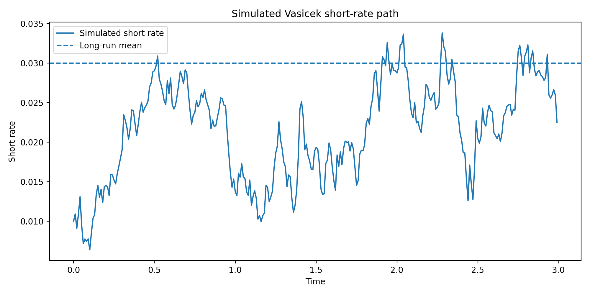
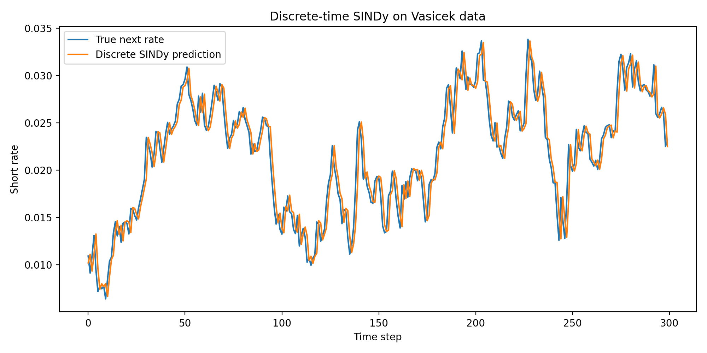
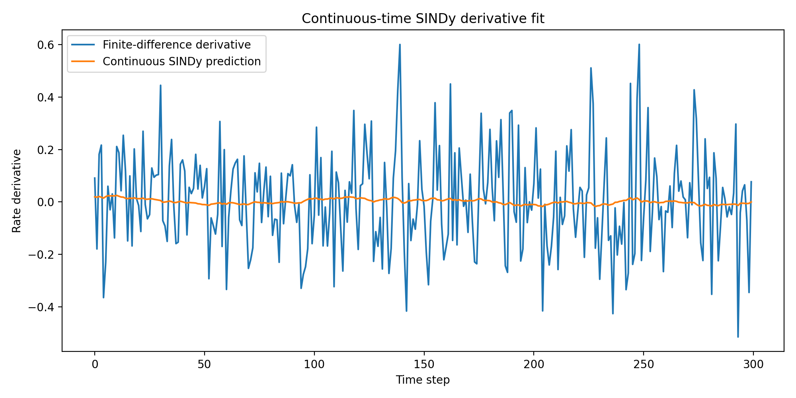

# Sparse Identification of Dynamical Systems from Scratch

A compact, from-scratch implementation of **Sparse Identification of Nonlinear Dynamics (SINDy)**, with experiments on synthetic dynamical systems, chaotic dynamics, and U.S. Treasury yields.

The project focuses on a central question in scientific machine learning:

> Can we recover interpretable governing equations directly from data?

Rather than using SINDy as a black-box package, this repository implements the core pipeline in NumPy and studies both where sparse equation discovery works and where it breaks down.

<p align="center">
  
</p>

## What this project demonstrates

- Construction of polynomial candidate libraries from scratch
- Sequential Thresholded Least Squares (STLSQ)
- Discrete-time and continuous-time SINDy
- Numerical simulation and derivative estimation
- Unit testing with `pytest`
- Chronological train/test evaluation for time-series data
- Comparison against simple forecasting baselines
- Critical analysis of model assumptions and failure modes

## Core idea

For a continuous-time dynamical system,

$$
\dot X(t)=f(X(t)),
$$

SINDy assumes that the dynamics can be represented by a sparse combination of candidate functions:

$$
\dot X \approx \Theta(X)\Xi.
$$

Here:

- $\Theta(X)$ is a candidate-library matrix,
- $\Xi$ is a sparse coefficient matrix,
- each column of $\Xi$ defines one discovered state equation.

For example, a quadratic library for three variables contains

$$
\Theta(X)
=
[
1,
x,
y,
z,
x^2,
xy,
xz,
y^2,
yz,
z^2
].
$$

The optimizer first fits least squares, removes small coefficients, and then refits only on the surviving terms.

## Experiments and key results

| Experiment | Main question | Result |
|---|---|---|
| **Lorenz system** | Can SINDy recover known nonlinear equations? | The correct 7 active coefficients are recovered from 30 candidates, with coefficient error near numerical precision. |
| **Vasicek / Ornstein–Uhlenbeck process** | Can SINDy identify mean reversion? | The discrete-time model closely recovers the theoretical Euler coefficients. The continuous-time model recovers the correct drift structure but is noisier because finite differences amplify diffusion noise. |
| **10-year Treasury yield** | Does SINDy improve one-day forecasts? | The learned coefficient is approximately $0.9997$, showing strong persistence. Linear SINDy performs almost identically to the persistence baseline, while the quadratic model is marginally worse. |
| **Yield-curve factors** | Can sparse equations identify dynamics in level, slope, and curvature? | Small out-of-sample improvements appear for level and slope, but not for curvature. Linear regime models are more interpretable than dense quadratic models. |

## 1. Lorenz system

The Lorenz equations are

$$
\dot x=-10x+10y,
$$

$$
\dot y=28x-y-xz,
$$

$$
\dot z=xy-\frac{8}{3}z.
$$

SINDy is given a larger quadratic library and correctly selects only the required terms.

This serves as a **positive control**: the system is closed, stationary, sparse, and fully represented by the candidate library.

## 2. Vasicek mean-reversion experiment

The Vasicek short-rate model is

$$
dr_t=\kappa(\theta-r_t)\,dt+\sigma\,dW_t.
$$

Its deterministic drift is linear:

$$
\kappa(\theta-r_t)=\kappa\theta-\kappa r_t.
$$

Therefore, the true drift is sparse in the library

$$
\Theta(r)=[1,r].
$$

The discrete-time SINDy model learns the conditional one-step transition, while the continuous-time model fits finite-difference derivative estimates.

<p align="center">
  
</p>

<p align="center">
  
</p>

A central limitation becomes visible in continuous time:

$$
\frac{r_{k+1}-r_k}{\Delta t}
=
\kappa(\theta-r_k)
+
\frac{\sigma}{\sqrt{\Delta t}}\varepsilon_k.
$$

Finite differences amplify the stochastic noise by a factor proportional to $1/\sqrt{\Delta t}$.

## 3. Real Treasury-yield experiments

The real-data notebooks use Treasury constant-maturity series from FRED.

The experiments examine:

- one-step prediction of the 10-year Treasury yield,
- level, slope, and curvature factor dynamics,
- linear versus quadratic candidate libraries,
- full-sample versus regime-specific models,
- comparison against persistence and zero-change baselines.

The main finding is that daily Treasury yields are dominated by persistence. Sparse models can reveal weak and interpretable structure, but additional nonlinear terms do not produce uniformly robust forecasting improvements.

These notebooks should be understood as **model-discovery experiments**, not as evidence of a profitable trading strategy.

## Repository structure

```text
sindy-finance/
├── figures/
│   ├── vasicek_path.png
│   ├── vasicek_discrete_prediction.png
│   └── vasicek_continuous_derivative.png
├── notebooks/
│   ├── 01_vasicek_sindy.ipynb
│   ├── 02_real_yield_sindy.ipynb
│   ├── 03_yield_curve_factors_sindy.ipynb
│   └── 04_lorenz_sindy.ipynb
├── src/
│   ├── __init__.py
│   ├── continuous_sindy.py
│   ├── discrete_sindy.py
│   ├── library.py
│   ├── simulation.py
│   └── stlsq.py
├── tests/
│   ├── test_continuous_sindy.py
│   ├── test_discrete_sindy.py
│   ├── test_library.py
│   └── test_stlsq.py
├── main.py
├── pytest.ini
├── requirements.txt
└── README.md
```

## Installation

Clone the repository and create a virtual environment:

```bash
git clone https://github.com/e-kru/sindy-finance.git
cd sindy-finance

python -m venv .venv
source .venv/bin/activate
```

Install the dependencies:

```bash
pip install -r requirements.txt
```

The main dependencies are:

- NumPy
- pandas
- Matplotlib
- SciPy
- requests
- certifi
- pytest
- Jupyter

## Run the tests

```bash
pytest -v
```

The test suite covers:

- polynomial-library construction,
- sparse coefficient recovery,
- discrete-time prediction,
- continuous-time derivative estimation,
- input validation and error handling.

## Run the Vasicek example

```bash
python main.py
```

This simulates a Vasicek process, fits discrete- and continuous-time SINDy models, prints the recovered equations, and saves the main figures.

## Run the notebooks

```bash
jupyter notebook
```

The real Treasury-yield notebooks download public FRED data at runtime and therefore require an internet connection.

## Main limitations

- The polynomial library currently supports degrees 1 and 2 only.
- STLSQ uses a fixed absolute threshold.
- Continuous-time SINDy relies on forward finite differences.
- The implementation does not include regularization, smoothing, uncertainty estimates, or automated model selection.
- Financial factor dynamics are not a closed system and are affected by omitted macroeconomic variables and regime changes.

These limitations are intentional: the implementation is designed to make the core mechanics transparent rather than to replace mature libraries such as PySINDy.

## References

- Brunton, S. L., Proctor, J. L., and Kutz, J. N. (2016). *Discovering governing equations from data by sparse identification of nonlinear dynamical systems*. Proceedings of the National Academy of Sciences.
- Kaptanoglu, A. A. et al. (2022). *PySINDy: A comprehensive Python package for robust sparse system identification*. Journal of Open Source Software.
- Federal Reserve Economic Data (FRED), Federal Reserve Bank of St. Louis.